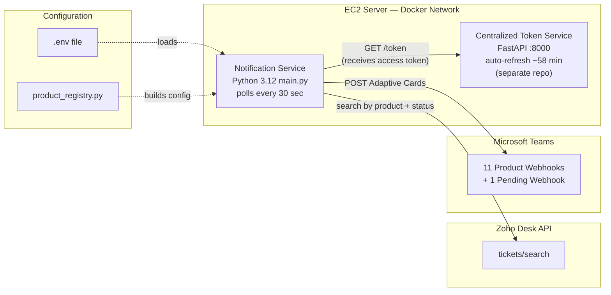
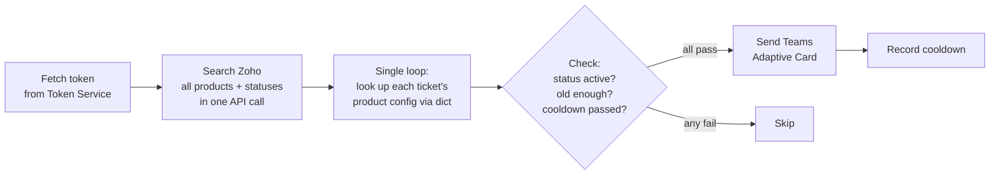
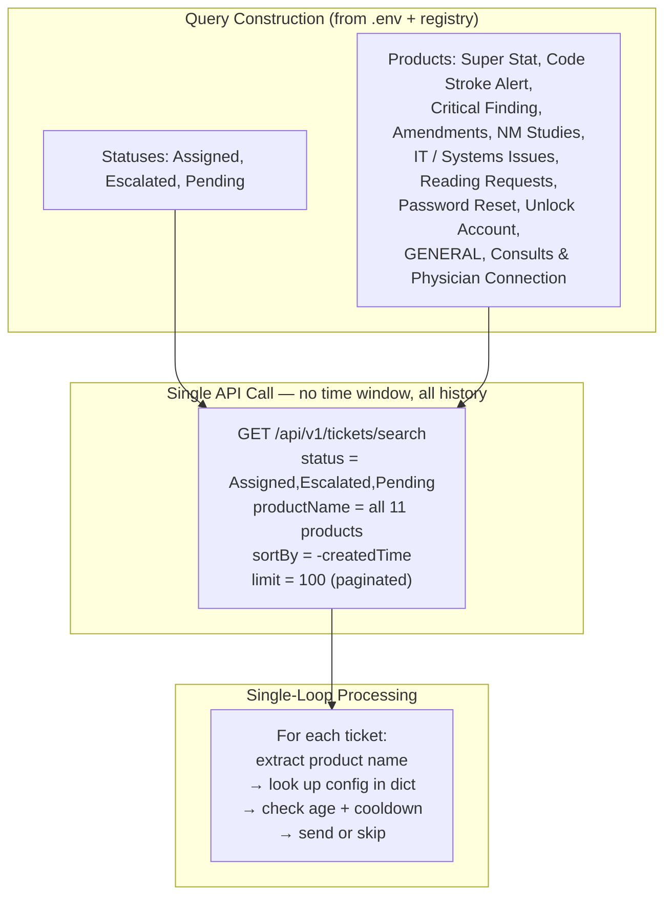
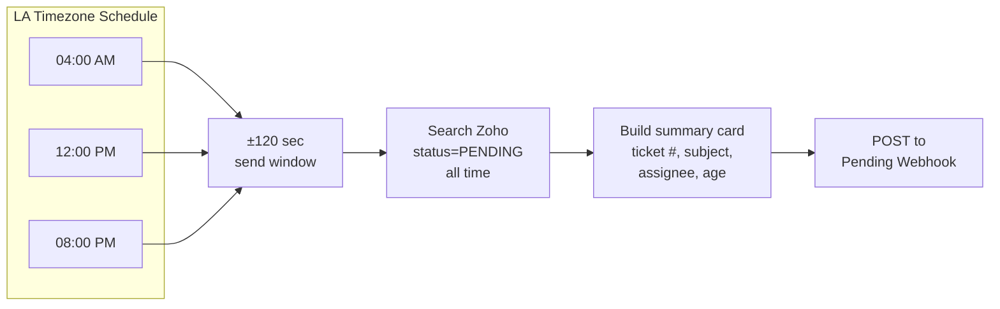

# Teams Notifications Service (Zoho Desk)

Automated Microsoft Teams notifications for Zoho Desk tickets, plus scheduled pending-ticket summaries.

Fully registry-driven: products are configured in `src/scripts/product_registry.py` and environment variables — no standalone per-product scripts.

## Architecture



## Polling Cycle (every 30 seconds)



**Checks applied per ticket (in order):**

1. Does the ticket have a product name that maps to a configured product?
2. Is the status in that product's active set?
3. Is the ticket old enough (age ≥ min_age_minutes)?
4. Has the cooldown window passed since last notification?

## How the Search Query Works



## Pending Summary Schedule



## Current Product Registry

| Product | Prefix | Min Age | Teams Webhook Env Var |
|---|---|---:|---|
| Super-Stat | `SUPERSTAT` | 5 min | `TEAMS_WEBHOOK_SUPERSTAT` |
| Code Stroke | `CODE_STROKE` | 5 min | `TEAMS_WEBHOOK_CODE_STROKE` |
| Critical Findings | `CRITICAL_FINDINGS` | 5 min | `TEAMS_WEBHOOK_CRITICAL_FINDINGS` |
| Amendments | `AMENDMENTS` | 60 min | `TEAMS_WEBHOOK_AMENDMENTS` |
| NM Studies | `NM_STUDIES` | 30 min | `TEAMS_WEBHOOK_NM_STUDIES` |
| IT / System Studies | `IT_SYSTEM_STUDIES` | 240 min | `TEAMS_WEBHOOK_IT_SYSTEM_STUDIES` |
| Reading Requests | `READING_REQUESTS` | 30 min | `TEAMS_WEBHOOK_READING_REQUESTS` |
| Password Reset | `PASSWORD_RESET` | 240 min | `TEAMS_WEBHOOK_PASSWORD_RESET` |
| Unlock Account | `UNLOCK_ACCOUNT` | 240 min | `TEAMS_WEBHOOK_PASSWORD_RESET` |
| General | `GENERAL` | 240 min | `TEAMS_WEBHOOK_GENERAL` |
| Consults & Physician Connection | `CONSULTS_AND_PHYSICIAN_CONNECTION` | 240 min | `TEAMS_WEBHOOK_CONSULTS_AND_PHYSICIAN_CONNECTION` |

Password Reset and Unlock Account are separate products that share the same Teams webhook.

Source of truth: `src/scripts/product_registry.py`.

## How Ticket Processing Works

The service uses a **single-loop architecture** — no per-product threads or workers.

1. One API call fetches all tickets matching any configured product name + status.
2. Zoho returns timestamps in UTC (`createdTime: "2026-02-19T04:51:42.000Z"`).
3. A `dict` maps each product name (lower-case) to its `ProductConfig`.
4. Each ticket is processed once: extract product name → look up config → check age + cooldown → send or skip.
5. Cooldown state is held in memory (per product) and persisted to JSON files only when alerts are sent.

**Cooldown precedence:**

1. `<PREFIX>_NOTIFY_COOLDOWN_SECONDS` (product-specific)
2. `NOTIFY_COOLDOWN_SECONDS` (global override)
3. `<PREFIX>_MIN_AGE_MINUTES × 60` (fallback)

## Repository Layout

```text
.
├── main.py                          # Entry point — single-loop polling
├── Dockerfile.notification          # Container image for the notification service
├── docker-compose.yml               # Orchestration (joins token service network)
├── src/
│   ├── core/
│   │   └── watch_helper.py          # Core logic: token, search, process_tickets, cards
│   ├── schema/
│   │   └── zoho_api_schemas.py      # Pydantic models for Zoho API validation
│   └── scripts/
│       ├── product_registry.py      # Declarative config for all 11 products
│       └── pending_watch.py         # Pending summary scheduler
├── scripts/
│   ├── create_test_tickets.py       # Creates one test ticket per product (end-to-end testing)
│   └── render_diagrams.py           # Renders Mermaid diagrams from README to PNG
├── tests/
│   ├── core/                        # Unit tests for watch_helper logic
│   └── scripts/                     # Parameterized tests for product registry
├── docs/diagrams/                   # Rendered PNG diagrams
├── credentials/                     # SSH keys and server connection info (git-ignored)
└── .github/workflows/
    └── ci.yml                       # CI (test on push) + CD (deploy on main)
```

## Deployment

### Docker Compose (Production)

The notification service runs as a single Docker container that connects to the centralized Zoho token service's Docker network:

```yaml
# docker-compose.yml
services:
  notification-service:
    build: { dockerfile: Dockerfile.notification }
    environment:
      TOKEN_SERVICE_URL: http://token-service:8000
    networks:
      - zoho-token-service_default

networks:
  zoho-token-service_default:
    external: true
```

Deploy commands:
```bash
docker compose up --build -d     # Start/rebuild
docker compose logs -f           # Watch logs
docker compose down              # Stop
```

### CI/CD

Workflow: `.github/workflows/ci.yml`

- **Test job**: runs on push to `main`/`dev` and PRs to `main` — installs deps, compiles, runs all tests.
- **Deploy job**: runs only on push to `main` after tests pass — SSHes to server, pulls latest, rebuilds container.

## Environment Configuration

### Token Service

- `TOKEN_SERVICE_URL` (default `http://host.docker.internal:8000`) — overridden to `http://token-service:8000` in Docker Compose.

### Core Runtime Controls

| Variable | Default | Purpose |
|---|---|---|
| `CHECK_EVERY_SECONDS` | `30` | Polling interval |
| `TZ_NAME` | `America/Los_Angeles` | Timezone for display and pending schedule |
| `MIN_AGE_MINUTES` | `5` | Global default minimum ticket age before alerting |
| `NOTIFY_COOLDOWN_SECONDS` | — | Optional global cooldown override |
| `PAGE_SIZE` | `100` | Zoho search page size |
| `PAGE_LIMIT` | `50` | Max pages to fetch (safety cap) |
| `ZOHO_DESK_ORG_ID` | — | **Required**: Zoho organization ID |
| `ZOHO_DESK_BASE` | `https://desk.zoho.com` | Zoho Desk API base URL |

### Per-Product Configuration

Each product prefix supports:
- `<PREFIX>_TARGET_PRODUCT_NAMES` — comma-separated product names (original casing preserved)
- `<PREFIX>_ACTIVE_STATUSES` — comma-separated statuses (default: `Assigned,Pending,Escalated`)
- `<PREFIX>_MIN_AGE_MINUTES` — minimum age before alerting
- `<PREFIX>_NOTIFY_COOLDOWN_SECONDS` — cooldown between repeat alerts

### Pending Summary

| Variable | Default | Purpose |
|---|---|---|
| `PENDING_STATUS_NAME` | `PENDING` | Status text for pending tickets |
| `PENDING_REPORT_TIMES_LA` | `04:00;12:00;20:00` | Scheduled report times (LA timezone) |
| `PENDING_REPORT_WINDOW_SECONDS` | `120` | Send window around each scheduled time |

## Running Locally

```bash
uv sync                                          # Install dependencies
uv run python main.py                            # Run the full service
uv run python src/scripts/pending_watch.py       # Run pending summary once
uv run --with pytest pytest -q                   # Run all tests
uv run python scripts/render_diagrams.py         # Re-render diagram PNGs
```

## How to Add a New Product

1. Add a new entry to `PRODUCT_REGISTRY` in `src/scripts/product_registry.py`.
2. Set `prefix`, `name`, `teams_webhook_env_var`, `last_sent_filename`, and `default_target_product_names`.
3. Add corresponding env vars in `.env` (at minimum: `<PREFIX>_TARGET_PRODUCT_NAMES` and the webhook).
4. Add a test case in `tests/scripts/test_product_watchers.py`.
5. Deploy — no new script module needed.

## State Files

- Cooldown files (`sent_<product>_notifications.json`) are written under `src/core/`.
- Pending slot state (`sent_pending_summary_slots.json`) tracks which time slots have been sent.
- **All state files are deleted on startup** — each restart begins fresh.
