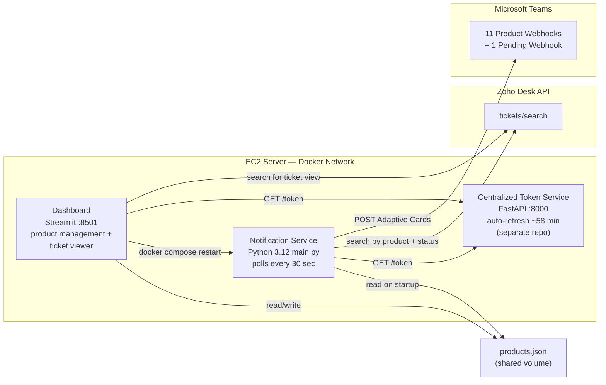
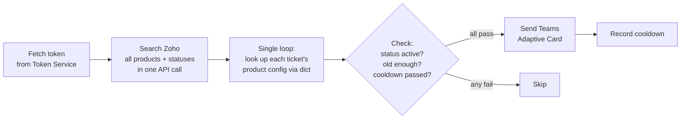
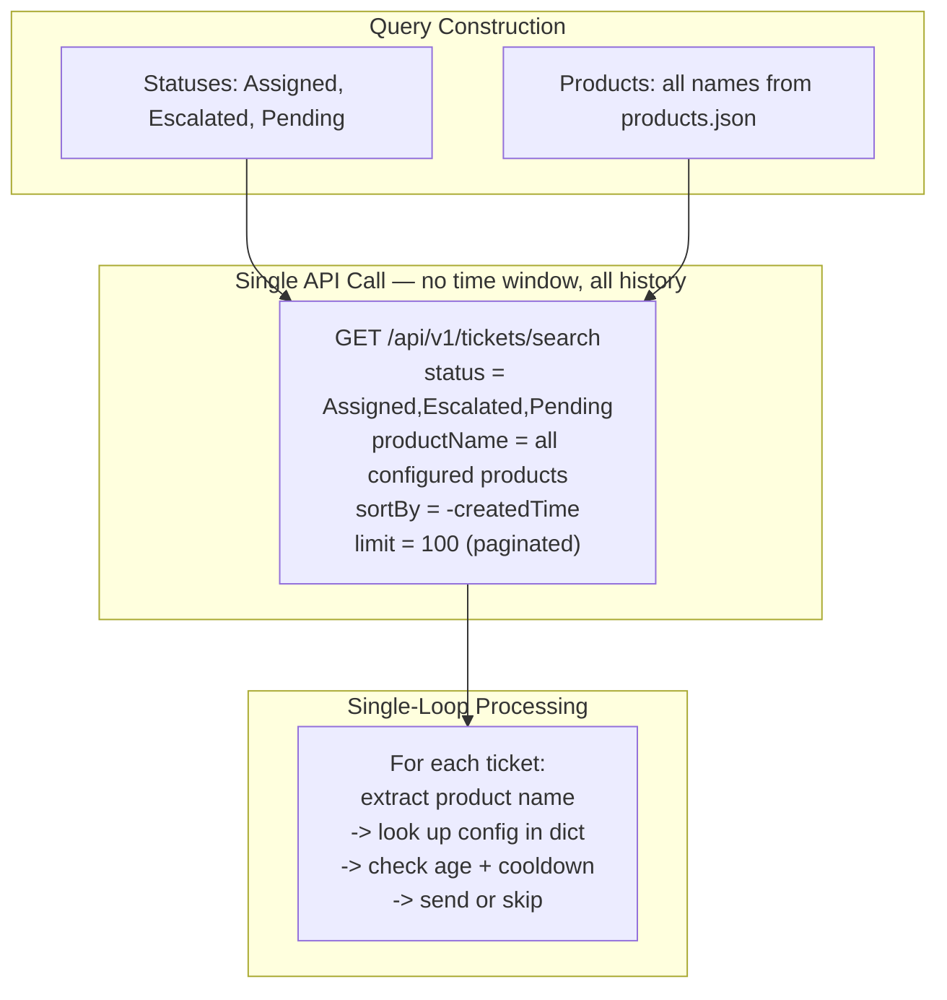

# Teams Notifications Service (Zoho Desk)

Automated Microsoft Teams notifications for Zoho Desk tickets, plus scheduled pending-ticket summaries.

Fully JSON-driven: products are configured in `products.json` via the Streamlit dashboard — no code changes needed to add or remove products.

## Architecture



## Polling Cycle (every 30 seconds)



**Checks applied per ticket (in order):**

1. Does the ticket have a product name that maps to a configured product?
2. Is the status in that product's active set?
3. Is the ticket old enough (age >= min_age_minutes)?
4. Has the cooldown window passed since last notification?

## How the Search Query Works



## Pending Summary Schedule


## Dashboard

The Streamlit dashboard runs as a separate Docker container on port 8501. It provides:

- **Products page** — view, add, remove products. Changes update `products.json` and automatically restart the notification service.
- **Active Tickets page** — live view of Zoho Desk tickets matching configured products.
- **Authentication** — login required (username/password via `secrets.toml`).

The dashboard is fully independent — if it crashes, the notification service keeps running.

## Product Configuration (products.json)

Products are configured in `products.json` on a shared Docker volume. The dashboard reads and writes this file. The notification service reads it on startup.

```json
{
  "products": {
    "super_stat": {
      "name": "Super-Stat",
      "teams_webhook_url": "https://your-webhook-url",
      "min_age_minutes": 5,
      "target_product_names": ["Super Stat"],
      "active_statuses": ["Assigned", "Pending", "Escalated"],
      "banner_text": "",
      "notify_cooldown_seconds": null
    }
  }
}
```

**Fields:**

| Field | Required | Description |
|---|---|---|
| `name` | Yes | Friendly display name |
| `teams_webhook_url` | Yes | Microsoft Teams webhook URL |
| `min_age_minutes` | Yes | Minimum ticket age before alerting |
| `target_product_names` | No | Zoho product names to match (defaults to `[name]`) |
| `active_statuses` | No | Statuses considered open (defaults to Assigned, Pending, Escalated) |
| `banner_text` | No | Instruction text shown at top of Teams card |
| `notify_cooldown_seconds` | No | Override cooldown between alerts (defaults to min_age_minutes x 60) |

Source of truth: `config/products.json` (managed via dashboard).

## How to Add a New Product

**Via the dashboard (recommended):**

1. Open the dashboard at `http://<server-ip>:8501`
2. Log in
3. Go to **Products** page
4. Fill in the **Add New Product** form (product name, webhook URL, min age)
5. Click **Add Product** — the notification service restarts automatically

**No code changes, no redeployment needed.**

## Repository Layout

```text
.
├── main.py                          # Entry point — single-loop polling
├── Dockerfile.notification          # Container image for the notification service
├── Dockerfile.dashboard             # Container image for the Streamlit dashboard
├── docker-compose.yml               # Orchestration (notification + dashboard + shared volume)
├── entrypoint.sh                    # Seeds products.json on first deploy
├── src/
│   ├── core/
│   │   ├── watch_helper.py          # Core logic: token, search, process_tickets, cards
│   │   └── config_manager.py        # Read/write products.json with file locking
│   ├── schema/
│   │   └── zoho_api_schemas.py      # Pydantic models for Zoho API validation
│   └── scripts/
│       ├── product_registry.py      # Loads ProductConfig objects from products.json
│       └── pending_watch.py         # Pending summary scheduler
├── dashboard/
│   ├── app.py                       # Streamlit entry point with auth gate
│   ├── pages/
│   │   ├── 1_products.py            # Product management page
│   │   └── 2_active_tickets.py      # Active ticket viewer
│   ├── utils/
│   │   ├── auth.py                  # Shared authentication helper
│   │   ├── docker_ops.py            # Container restart via docker compose
│   │   └── zoho_client.py           # Zoho API client for ticket queries
│   └── .streamlit/
│       ├── config.toml              # Streamlit theme settings
│       └── secrets.toml             # Auth credentials (gitignored)
├── config/
│   └── products.json.example        # Sample product config for reference
├── scripts/
│   ├── create_test_tickets.py       # Creates test tickets for each product
│   ├── migrate_to_json.py           # One-time migration from old registry to JSON
│   └── render_diagrams.py           # Renders Mermaid diagrams to PNG
├── tests/
│   ├── core/                        # Unit tests for watch_helper logic
│   └── scripts/                     # Tests for product registry JSON loading
├── docs/diagrams/                   # Rendered PNG diagrams
├── credentials/                     # SSH keys and server info (gitignored)
└── .github/workflows/
    └── ci.yml                       # CI (test on push) + CD (deploy on main)
```

## Deployment

### Docker Compose (Production)

Three containers on a shared Docker network:

```yaml
services:
  notification-service:          # Polls Zoho, sends Teams alerts
    volumes: [shared-config]     # Reads products.json
    networks: [zoho-token-service_default]

  dashboard:                     # Streamlit admin UI
    ports: ["8501:8501"]         # Exposed to internet
    volumes: [shared-config, docker.sock, dashboard-logs]
    networks: [zoho-token-service_default]

volumes:
  shared-config:                 # products.json (shared between services)
  dashboard-logs:                # Persistent dashboard logs
```

Deploy commands:
```bash
docker compose up --build -d     # Start/rebuild
docker compose logs -f           # Watch logs
docker compose down              # Stop
```

### CI/CD

Workflow: `.github/workflows/ci.yml`

- **Test job**: runs on push to `main`/`dev` and PRs to `main` — installs deps, compiles, runs all tests.
- **Deploy job**: runs only on push to `main` after tests pass — SSHes to server, pulls latest, rebuilds containers.

## Environment Configuration

### Core Settings (.env)

| Variable | Default | Purpose |
|---|---|---|
| `CHECK_EVERY_SECONDS` | `30` | Polling interval |
| `TZ_NAME` | `America/Los_Angeles` | Timezone for display and pending schedule |
| `MIN_AGE_MINUTES` | `5` | Global default minimum ticket age |
| `NOTIFY_COOLDOWN_SECONDS` | — | Optional global cooldown override |
| `PAGE_SIZE` | `100` | Zoho search page size |
| `PAGE_LIMIT` | `50` | Max pages to fetch (safety cap) |
| `ZOHO_DESK_ORG_ID` | — | **Required**: Zoho organization ID |
| `ZOHO_DESK_BASE` | `https://desk.zoho.com` | Zoho Desk API base URL |
| `TOKEN_SERVICE_URL` | `http://host.docker.internal:8000` | Token service URL (overridden in Docker Compose) |
| `PRODUCTS_JSON_PATH` | `config/products.json` | Path to products config file (overridden in Docker Compose) |
| `MAGIC_TEST_WEBHOOK` | — | Webhook URL for magic test phrase tickets |
| `MAGIC_TEST_TRIGGER_PHRASE` | `test ticket by magic ai` | Phrase that routes tickets to test webhook |

### Pending Summary (.env)

| Variable | Default | Purpose |
|---|---|---|
| `PENDING_STATUS_NAME` | `PENDING` | Status text for pending tickets |
| `PENDING_REPORT_TIMES_LA` | `04:00;12:00;20:00` | Scheduled report times (LA timezone) |
| `PENDING_REPORT_WINDOW_SECONDS` | `120` | Send window around each scheduled time |

## Running Locally

```bash
uv sync                                          # Install dependencies
uv run python main.py                            # Run the notification service
uv run python src/scripts/pending_watch.py       # Run pending summary once
uv run --with pytest pytest -q                   # Run all tests
uv run python scripts/render_diagrams.py         # Re-render diagram PNGs
```

## State Files

- Cooldown files (`sent_<product>_notifications.json`) are written under `src/core/`.
- Pending slot state (`sent_pending_summary_slots.json`) tracks which time slots have been sent.
- **All state files are deleted on startup** — each restart begins fresh.
